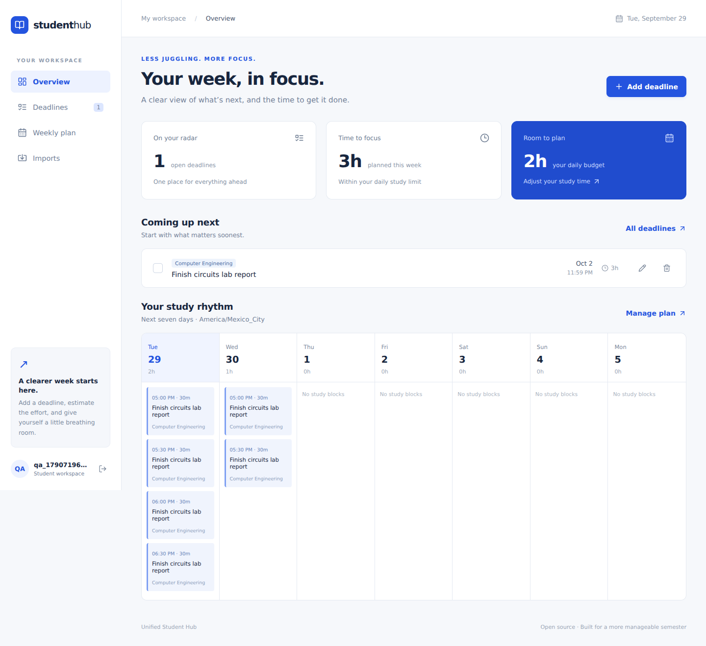

# Unified Student Hub

**Your deadlines, calendar, and a week you can actually manage.**

An open-source, self-hostable student workspace by **Hans Luis Cabauatan**. Import coursework, review the dates, and turn estimated effort into a realistic seven-day study plan.

React · FastAPI · PostgreSQL · SQLite for local development · MIT license

## What works in v0.1

- Separate student accounts with hashed passwords and server-side sessions.
- Add, edit, complete, search, and delete deadlines; organize them by course.
- Review-first PDF/TXT syllabus extraction. Edit titles, dates, courses, and effort before saving.
- ICS calendar imports as busy time or assignment deadlines, plus deadline export.
- Canvas assignment and Moodle due/close event adapters with on-demand previews.
- Earliest-deadline-first planning in 30-minute blocks, with a daily effort budget and timezone selection.
- Workload warnings for overdue tasks and work that cannot fit into the chosen week.
- Repeated imports update matching items without resetting completion or effort estimates.
- Guided three-step onboarding and removable sample deadlines dated for the coming week.
- Account-saved timezone, study hours, and daily budget across refreshes and devices.
- Responsive interface, sample files, CI checks, and documented extension points.



**Release status:** functional initial release for local use and small self-hosted pilots. Live school integrations require school-issued tokens and have not been validated against a real institution in this release. See [verification and limits](docs/VERIFICATION.md).

## Quick start: Docker + PostgreSQL

Install Docker with Compose, download/clone this repository, and open a terminal inside its root folder.

```bash
cp .env.example .env
python -c "import secrets; print(secrets.token_hex(24))"
```

On Windows PowerShell, use `Copy-Item .env.example .env` instead of `cp`. Put the generated value into `POSTGRES_PASSWORD` in `.env` (do not commit that file).

```bash
docker compose up --build -d
```

Open **http://localhost:8000**, create an account, and add a deadline. For interactive API documentation, open **http://localhost:8000/docs**.

```bash
docker compose logs -f app
docker compose down
```

The database survives normal stops. `docker compose down -v` permanently removes it, so avoid that command unless you intend to erase your data.

## Local development without Docker

Requires Python 3.12 and Node.js 22+.

```bash
python -m venv .venv
```

Activate the environment:

```bash
# Windows PowerShell
.venv\Scripts\Activate.ps1
# macOS / Linux
source .venv/bin/activate
```

Then:

```bash
pip install -r backend/requirements.txt
npm ci --prefix frontend
npm run build --prefix frontend
cd backend
uvicorn app.main:app --host 127.0.0.1 --port 8000
```

This creates a local SQLite database in `backend/hub.db`. No database setup is needed. Environment variables in `.env` are read by Docker Compose; for local `uvicorn`, export them in your terminal if needed.

For frontend hot reload, run `npm run dev --prefix frontend` from a second terminal at the repository root. Open the URL Vite prints. Its `/api` proxy forwards requests to FastAPI on port 8000. The backend continues running in the first terminal.

## Codespaces

The included development-container configuration installs the dependencies and builds the interface. See [step-by-step Codespaces instructions](docs/CODESPACES.md).

## First visit

Follow the checklist on **Overview**: add a deadline, save study hours, then review **Weekly plan**. **Try sample deadlines** adds three clearly labeled practice tasks dated two, four, and six days ahead in the selected study timezone. Repeated clicks do not duplicate or reset existing samples. **Remove sample deadlines** deletes only those practice tasks, including edits to them; real coursework stays.

For the five-student pilot and remaining hosting work, see [the beta launch checklist](docs/BETA.md).

## Try a full workflow

1. Create an account and open **Imports → Syllabus**.
2. Upload `samples/syllabus.txt` and click **Preview import**.
3. Review dates, replace course names, and adjust effort estimates; then confirm.
4. Import `samples/calendar.ics` as **Busy time**.
5. Open **Weekly plan**, select **2030-01-01**, and choose **Asia/Manila**, **17:00–21:00**, **120 minutes/day**. Samples use fixed future dates so they are reproducible; change dates for your semester.
6. Add a large task due tomorrow to see the workload warning.
7. Complete a deadline and watch the plan recalculate.

## Connect a school LMS

The server owner must set `LMS_ALLOWED_HOSTS` to exact trusted school hostnames. Blank disables network imports. Only allow domains operated by institutions you trust; the server sends tokens to these domains.

```dotenv
LMS_ALLOWED_HOSTS=university.instructure.com,moodle.university.edu
```

Restart/recreate the app after changing this setting:

```bash
docker compose up -d --force-recreate app
```

- **Canvas:** provide the HTTPS school URL, your personal access token, and course IDs from course URLs. Imports dated assignments that do not show a submitted timestamp for your account. Pagination is bounded to 20 pages per course; previews are capped at 500 deadlines. Individual due dates depend on what Canvas returns for the authenticated student.
- **Moodle:** provide the HTTPS site root (including a subdirectory if applicable), an approved web-service token, and numeric course IDs. The service must expose `core_calendar_get_calendar_events`. Imports `due` and `close` calendar events for the next 180 days. School settings and plugins affect which events are available; inspect the preview.
- Tokens are used for the current request, not saved in the database. Import again when you want refreshed deadlines. This version does not run background sync or OAuth.
- If the institution disables token/API access, use a syllabus or ICS export instead.

## Important behavior

- PDF extraction handles **text PDFs**, not scans. Supported dates: `YYYY-MM-DD` and full English month dates such as `January 2, 2030`. Every extracted date is a **candidate**, not a verified assignment. Defaults to 23:59 in the chosen import timezone. Always review the original document.
- ICS recurring events are deliberately skipped with a visible warning. Export expanded individual occurrences or use single events. All-day busy events block the full local day; all-day deadlines default to 23:59.
- Planning uses one daily time window for all seven days, earliest due date first, and a daily budget. It is deterministic, not an AI prediction. A busy event overlapping a 30-minute grid block excludes that whole block. It schedules only future time and reports leftover effort.
- Planning does not mark work complete or track elapsed study time. Update the remaining minutes as you work. Timezone, study hours, and daily budget are saved to your account when you select **Save preferences & update plan**. The displayed week starts on the current device date when you return; a manually selected week is not saved.
- Re-imported matching deadlines update their title, course, and date but keep your completion flag and effort. Imported busy events match by ICS UID; changing a syllabus line creates a new candidate. There is no automatic deletion when a source item disappears.
- No email, password reset, OAuth, notifications, recurring calendar expansion, or university SSO yet.

## Share with other people

Making the repository public lets others download, fork, extend, and self-host it. A GitHub repository alone does **not** run this backend. GitHub Pages cannot host FastAPI/PostgreSQL.

For a shared browser URL, deploy the Docker app behind an HTTPS reverse proxy and a durable PostgreSQL database. Follow [deployment notes](docs/DEPLOYMENT.md). This initial release is not a managed campus-wide service or an uptime promise.

## Tests and development

```bash
# From the repository root, with your virtual environment active
cd backend
python -m pytest -q
# Back at the root
cd ..
npm ci --prefix frontend
npm run build --prefix frontend
```

[Architecture](docs/ARCHITECTURE.md) · [Contributing](CONTRIBUTING.md) · [Security](SECURITY.md) · [Verification](docs/VERIFICATION.md)

## Roadmap

- Recurring calendar expansion and per-day availability.
- Progress tracking (study preferences are already persistent).
- OAuth integrations and opt-in scheduled sync.
- Password recovery, campus SSO, and account deletion.
- Database migrations, shared rate limiting, and larger deployment testing.

These are future work, not current features. Contributions are welcome under the MIT license.
